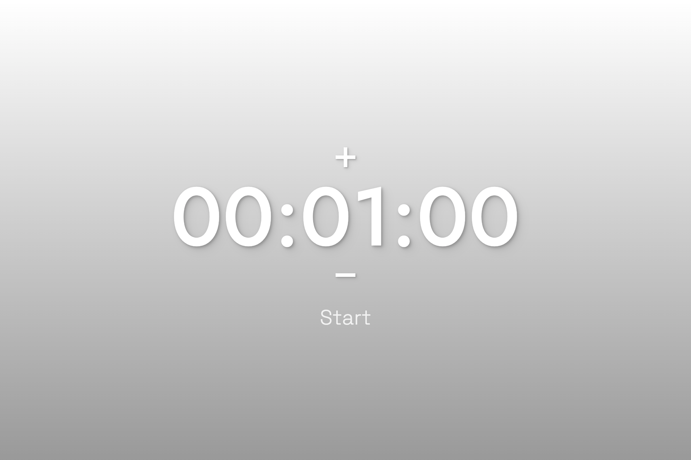
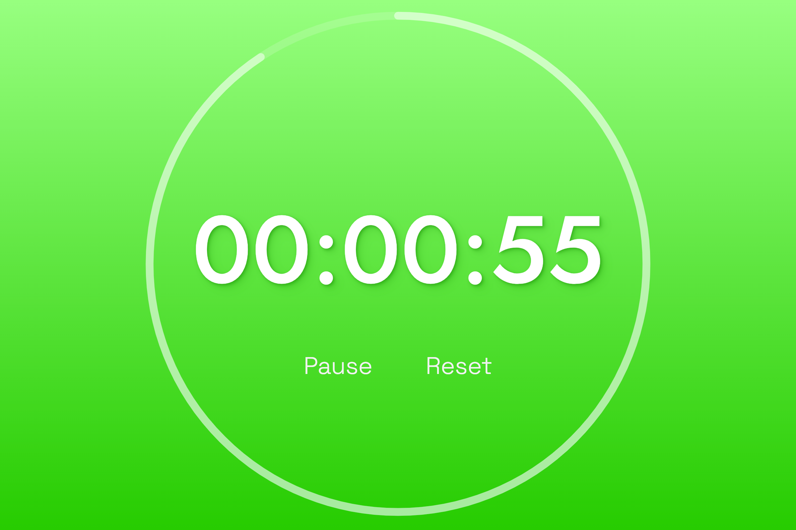
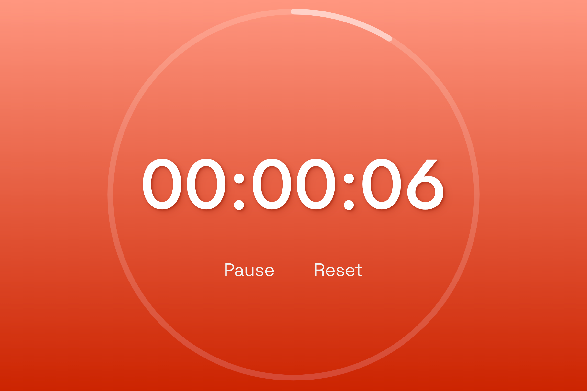

# ⏱️ Countdown Timer

A sleek, responsive, touch-friendly countdown timer built with HTML, CSS, and JavaScript. It features a large numeric display, intuitive time adjustment controls, smooth animations, and an audible alert when time runs out.

---

## 🚀 Features
### 🎛 Adjustable Time Controls
- Hover over hours, minutes, or seconds to reveal + / − step controls
- Modify each unit independently
- Smooth fade-in/out of controls based on pointer movement

## 🔔 End-of-Time Warning
- Plays an alert sound when the timer finishes
- Uses a flashing animation to draw attention

## 🌈 Dynamic Visual Feedback
- Circular countdown ring that depletes as time runs out
- Background color gradually shifts hue as the timer progresses
- Text shadow colors adapt automatically

## 💻 Fully Responsive
- Scales elegantly to any screen size using modern viewport units
- Optimized for desktops, tablets, and mobile devices

---

# 🧪 Images

